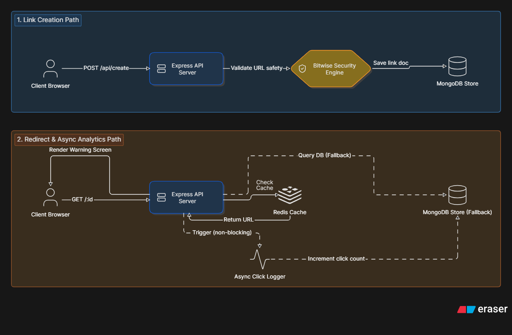

# SnapUrl

What happens when a URL shortener gets hit with thousands of clicks at once? SnapUrl is built to handle it.

Most URL shorteners slow down under load because they force users to wait while the server logs the click to a database. SnapUrl is a high-speed redirection engine that solves this latency bottleneck using Node.js, Express, Upstash Redis, and MongoDB.



## Core Design & Performance Decisions

### 1. Decoupled Read Path

Redirect requests are read-heavy. To keep latency low:

- We check the Redis cache first. If it's a hit, the redirect resolves in under 1ms.
- If it's a miss, we fetch from MongoDB and write it to Redis for subsequent hits.
- To prevent database write locks from blocking redirects, click counts are logged asynchronously. The server sends the response to the client immediately and delegates the MongoDB update to Node's event loop using `setImmediate()`.

**Trade-off:** Decoupling the write path means click analytics are processed a split-second after the user redirects, but it cut our worst-case (p99) latency by **83%** (from **4.6s** down to **758ms**) under stress tests.

### 2. Bitwise IP Subnet Matching (SSRF Blocker)

To prevent users from shortening links pointing to internal services or cloud metadata endpoints (e.g. AWS/GCP's `169.254.169.254`), we enforce IP validation on creation.

- The destination hostname is parsed, split, and converted into a 32-bit integer.
- The integer is compared against private IP subnets (RFC 1918) using bitwise masking:

```text
(ipVal & subnet.mask) === subnet.network
```

- This blocks loopbacks, private networks, and alternative IP representations (hex/octal/integer bypasses) instantly in CPU registers.

### 3. Session Management

Authentication uses a split-token architecture:

- **10-minute Access Token**
- **7-day Refresh Token** stored in HttpOnly cookies

When the access token expires, the client automatically requests a refresh token exchange at:

```text
/api/auth/refresh
```

to obtain a new access token, keeping users signed in while reducing session theft risk.

### 4. Telemetry Endpoint

The backend exposes a Prometheus-compatible metrics endpoint at:

```text
/metrics
```

It tracks:

- Cache hits
- Cache misses
- Rate limit blocks
- Process memory usage

---

## Tech Stack

- **Backend:** Node.js (ES Modules), Express
- **Frontend:** React (Vite), TanStack Router, Tailwind CSS, TanStack Query
- **Databases:** MongoDB Atlas (Persistent Store), Upstash Redis (Cache & Rate Limiting)
- **Authentication:** JWT Access Token + HttpOnly Refresh Token Cookies
- **Testing & Observability:** Autocannon, Prometheus Metrics

---

# Backend Setup

### 1. Create a `.env` file

Inside the `backend/` directory:

```env
MONGO_URI=your_mongodb_connection_string
REDIS_URL=your_redis_connection_string
JWT_SECRET=your_secret
REFRESH_SECRET=your_refresh_secret
APP_URL=http://localhost:5173
NODE_ENV=development
```

### 2. Install dependencies and run

```bash
cd backend
npm install
npm run dev
```

### 3. Build and run with Docker

```bash
cd backend
docker build -t snapurl-backend .
docker run -p 3000:3000 --env-file .env snapurl-backend
```

---

# Frontend Setup

### Install dependencies and run

```bash
cd frontend
npm install
npm run dev
```

---

# Benchmarking

### Run an Autocannon stress test

```bash
npx autocannon -c 100 -d 10 http://localhost:3000/your-slug
```

### View live metrics

Open:

```text
http://localhost:3000/metrics
```

---
## Performance Metrics (Local Stress-Test)
Below are the benchmark results captured using `Autocannon` under a load of **100 concurrent connections**:
- **Average Throughput**: 200.1 requests/second
- **Average Latency**: 488.7 ms
- **99th Percentile (p99) Latency**: 753 ms
- **Successful Requests**: 2,000 requests in 10s (0.00% error rate)
